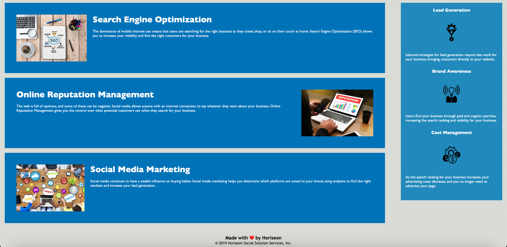

# Challenge-Numero-Uno

## Description
This project is my first coding homework assignment and it was assigned to me in order to apply what I have learned about semantic html in order to make the website more accessible. I was tasked with checking the satrter code in the html and css file provided and fix the mistakes in it. Once I was able to fix the issues on the code, the website was more accessible and functioned properly. This assignment helped me learn how to take a closer look at the code and start thinking about how it can be improved that way the webite that renders is functioning properly.

## Usage

## Link
[Link to my deployed gh-pages website](https://jadyngg19.github.io/Challenge-Numero-Uno/)
